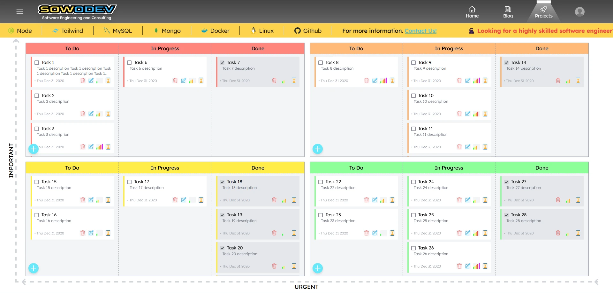
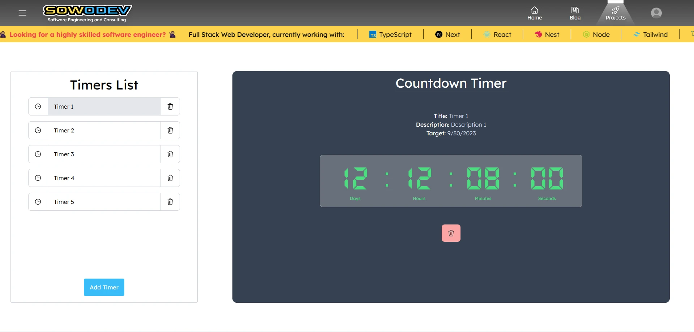
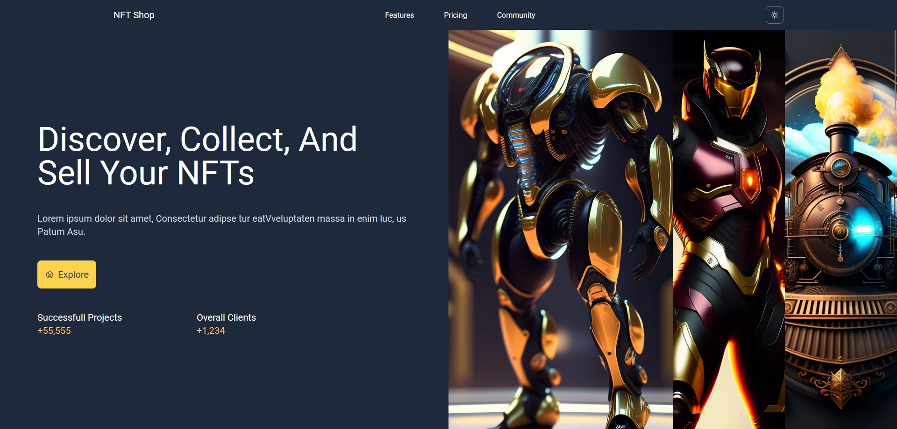

    

 

# Sowodev Portfolio

Welcome to my portfolio website, showcasing a collection of my work, skills, and experiences as a full stack web developer. This portfolio serves as a window into my world as a passionate coder, designer, and problem solver. Feel free to explore, learn more about me, and discover the projects I've worked on.

## Table of Contents

1. [About Me](#about-me)
2. [Projects](#projects)
3. [Skills](#skills)
4. [Stack](#stack-used)
5. [Contact](#contact)
6. [Deployment](#deployment)
7. [Acknowledgment](#acknowledgment)

## About Me

I am a dedicated and creative full stack web developer with a passion for building high quality web applications that not only work flawlessly but also provide an excellent user experience, also being robust, reliable, secure and scalable. I have been dedicating the past few years of my life mastering the art of building relentless software, so that I can make a huge difference wherever I go, guiding those who I work with to the highest standards when deploying state-of-the-art web applications.

**Key Highlights:**

- 🌐 Full-stack web developer with expertise in both front-end and back-end technologies.
- 💡 Strong problem-solving skills and a knack for finding elegant solutions.
- 🚀 Adept at working with various programming languages, libraries, and frameworks.
- 🎨 A passion for design, with an eye for creating visually appealing and user-friendly interfaces.
- 🌍 A global mindset, having collaborated on projects with teams from different corners of the world.

## Projects

### Project 1: [Tasks Manager with Smooth Drag and Drop](https://www.sowodev.com/projects/tasks-manager)

 
_Description:_ A full tasks manager application, create, update, read and delete tasks, with a beatiful and smooth drag and drop.

### Project 2: [Countdown Timer](https://www.sowodev.com/projects/countdown-timer)

_Description:_ A full countdown timer application manager, create, update, read and delete timers, with custom hours and dates.

### Project 3: [Nft Shop Landing Page](https://nftshop-wendelloliveira.netlify.app/)

_Description:_ A beatiful Nft Shop Landing page (needs some improvement).

Explore more of my projects on my [Portfolio Website](https://www.sowodev.com/).

## Skills

Here are some of the skills and technologies I have expertise in:

- **Front-end Development:**

  - HTML5, CSS3, JavaScript
  - React.js, Next.js, Tailwind CSS
  - React Query, React Router
  - Responsive web design
  - UI/UX design principles

- **Back-end Development:**

  - Node.js, Nest.js
  - RESTful APIs
  - Typeorm
  - Database design and management (SQL and NoSQL)

- **DevOps:**

  - Docker
  - Continuous Integration/Continuous Deployment (CI/CD)
  - Cloud Deploy

- **Other:**
  - Version control (Git)
  - Agile and Scrum methodologies
  - Problem-solving and critical thinking

## Stack Used

   <table>
      <tr>
          <td width="60">
               
React

          </td>
          <td width="60">
               
Nest

          </td>
          <td width="60">
               
NodeJS

          </td>
          <td width="60">
               
Linux

          </td>
          <td width="60">
               
 Git

          </td>
      </tr>
      <tr>
          <td width="60">
               
TypeScript

          </td>      
          <td width="60">
               
JavaScript

          </td>
          <td width="60">
               
HTML

          </td>
          <td width="60">
               
CSS

          </td>
          <td width="60">
               
MySQL

          </td>                                
      </tr>   
      <tr>
          <td width="60">
               
Github

          </td>
                    <td width="60">
               
Tailwind

          </td>
          <td width="60">
               
Postman

          </td> 
          <td width="60">
               
Vite

          </td> 
          <td width="60">
               
VSCode

          </td>                  
      </tr>
      <tr>
          <td width="60">
               
RESTApi

          </td>                 
          <td width="60">
               
MongoDB

          </td>
          <td width="60">
               
TypeORM

          </td>                      
          <td width="60">
               
Figma

          </td>
          <td width="60">
               
Prettier

          </td>     
      </tr>      
   </table>

## Contact

I'm always open to new opportunities and collaborations. If you'd like to get in touch with me or discuss a potential project, feel free to reach out:

- **Email:** [wendelloliveirasud@gmail.com](mailto:wendelloliveirasud@gmail.com)
- **LinkedIn:** [LinkedIn Profile](https://www.linkedin.com/in/wendelloliveiradasilva/)
- **GitHub:** [GitHub Profile](https://github.com/sowodev)

Thank you for visiting my portfolio, and I look forward to connecting with you!

## Deployment

- **Planet Scale**: for MySQL Database.
- **Cyclic**: for the NestJS Backend.
- **Netlify**: for the React Frontend.

## Next Steps

- Translate to brazilian portuguese and add a language choice button.
- Add Auth.
- Create a Next.js version
- Improve Backend.
- Add Store.
- Add Some More Projects like:
   

   
Next projects list

     
     - [ ] Car Shop.
     - [ ] An AI SaaS.
     - [ ] Real time chat with WebSockets.
     - [ ] A game accesories finder.
   

- Refactor And Test

## Acknowledgment

There is much work to do, so keep that in mind. If you want, feel free to use any part of the code. Any questions or suggestion, please get it touch through my contact section.
